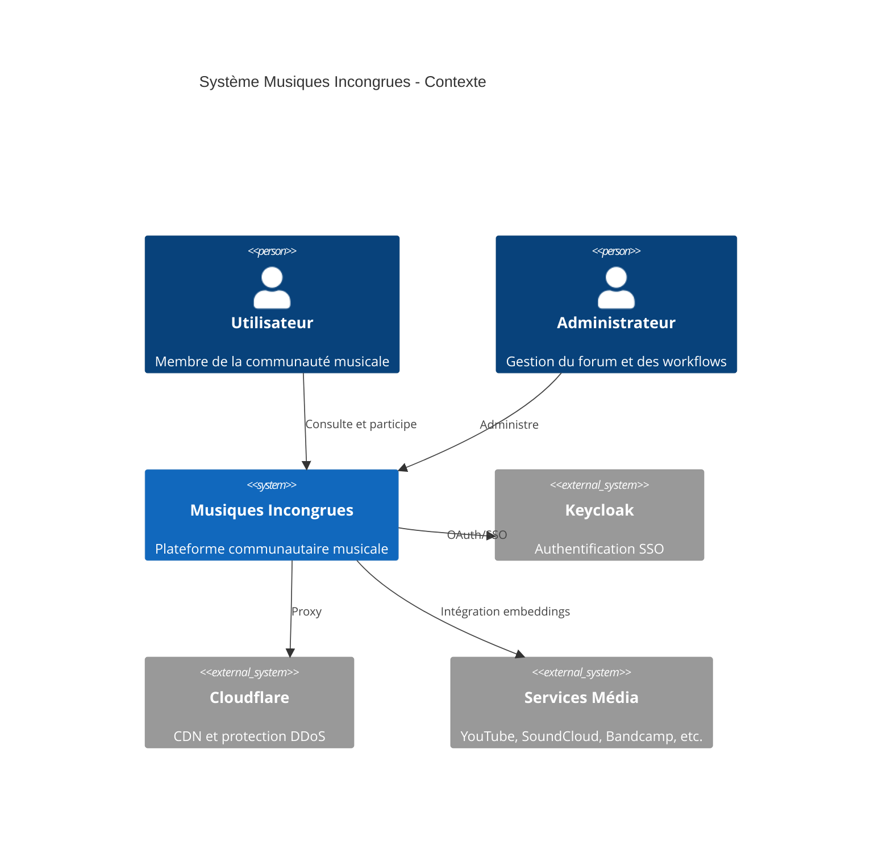
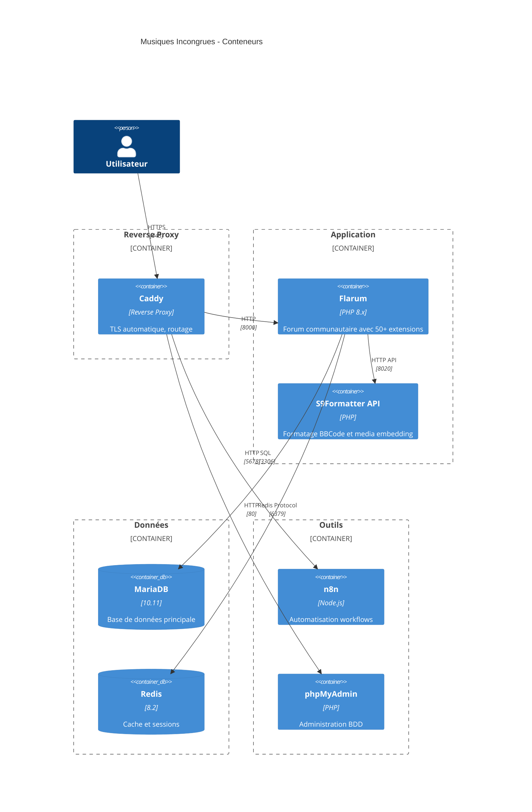
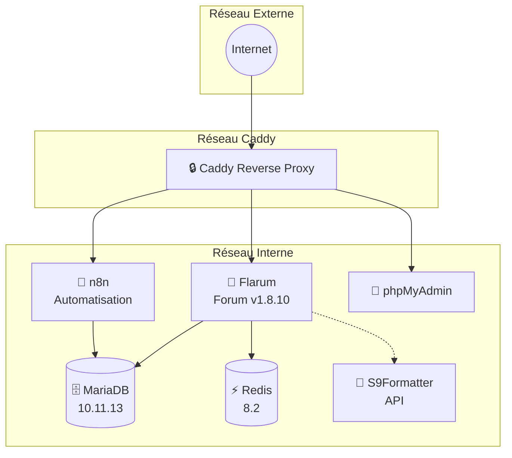

# Architecture - Musiques Incongrues

Document décrivant l'architecture technique de la plateforme Musiques Incongrues.

## Vue d'ensemble

Musiques Incongrues est une plateforme communautaire musicale basée sur **Flarum**, orchestrée via Docker Compose avec un reverse proxy Caddy.

## Diagramme de contexte (C4 - Niveau 1)

## Diagramme des conteneurs (C4 - Niveau 2)

## Architecture des services Docker

## Services

| Service | Image | Port | Description |
|---------|-------|------|-------------|
| **flarum** | `crazymax/flarum:1.8.10` | 8000 | Forum communautaire |
| **mariadb** | `mariadb:10.11.13` | 3306 | Base de données |
| **redis** | `redis:8.2` | 6379 | Cache et sessions |
| **n8n** | `n8nio/n8n:1.118.2` | 5678 | Automatisation |
| **phpmyadmin** | `phpmyadmin` | 80 | Admin BDD |
| **s9formatter** | Custom build | 8020 | API formatage texte |

## Domaines

| Sous-domaine | Service |
|--------------|---------|
| `www.musiques-incongrues.net` | Flarum |
| `n8n.musiques-incongrues.net` | n8n |
| `pma.musiques-incongrues.net` | phpMyAdmin |

## Flarum - Extensions clés

### Authentification & Sécurité
- `fof/oauth` - Authentification OAuth
- `spookygames/flarum-ext-auth-keycloak` - SSO Keycloak
- `fof/doorman` - Invitations
- `nearata/flarum-ext-cloudflare` - Support Cloudflare

### Contenu & Média
- `fof/upload` - Upload de fichiers
- `fof/discussion-thumbnail` - Miniatures
- `the-turk/flarum-flamoji` - Emojis personnalisés
- `constructions-incongrues/flarum-lite-youtube` - Intégration YouTube

### UX & Navigation
- `askvortsov/flarum-pwa` - Progressive Web App
- `v17development/flarum-seo` - Optimisation SEO
- `fof/sitemap` - Sitemap

### Modération
- `fof/anti-spam` - Protection spam
- `nodeloc/flarum-auto-moderator` - Modération automatique
- `fof/impersonate` - Impersonation admin

## S9Formatter API

Service de formatage de texte BBCode avec support d'intégration multimédia :

**Fonctionnalités :**
- BBCodes standard (B, I, URL, QUOTE, IMG)
- Media embeds : Bandcamp, Dailymotion, Imgur, Mixcloud, SoundCloud, Vimeo, YouTube
- Auto-liens et auto-images
- Conversion d'encodage (UTF-8, ISO-8859-1)

## Volumes persistants

| Volume | Usage |
|--------|-------|
| `db_data` | Données MariaDB |
| `flarum_data` | Données Flarum |
| `flarum_vendor` | Dépendances PHP |
| `n8n_data` | Workflows n8n |
| `redis_data` | Cache Redis |

## Configuration

### Variables d'environnement principales

| Variable | Description |
|----------|-------------|
| `FLARUM_BASE_URL` | URL du forum |
| `MYSQL_*` | Credentials MariaDB |
| `WEBHOOK_URL` | URL webhooks n8n |
| `TZ` | Timezone (Europe/Paris) |

## Sécurité

- **TLS** : Géré automatiquement par Caddy
- **Cloudflare** : Protection DDoS et CDN
- **OAuth** : Authentification externe via Keycloak
- **Redis** : Sessions sécurisées
